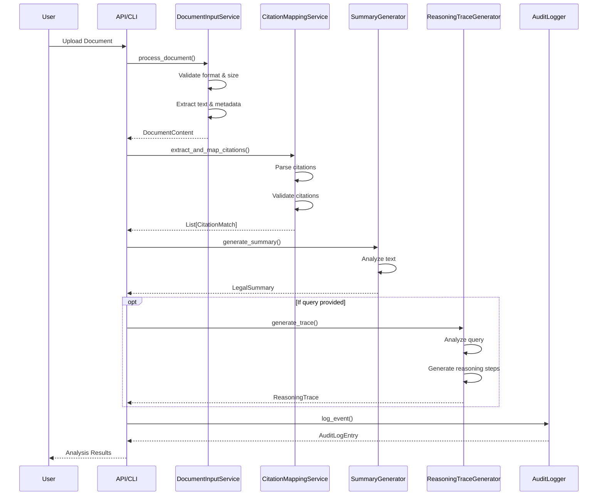
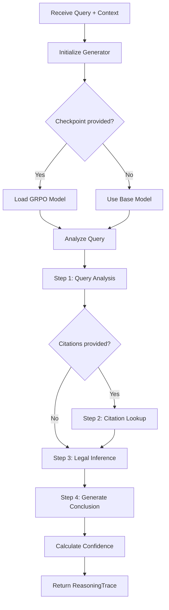
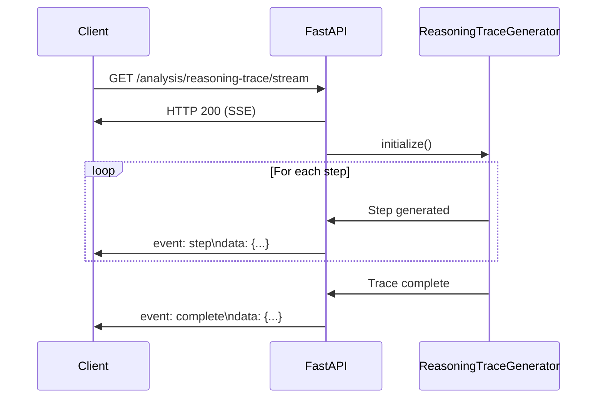

# Data Flow Diagram

## Document Processing Flow

```mermaid
sequenceDiagram
    participant U as User
    participant API as API/CLI
    participant DI as DocumentInputService
    participant CM as CitationMappingService
    participant SG as SummaryGenerator
    participant RT as ReasoningTraceGenerator
    participant AL as AuditLogger

    U->>API: Upload Document
    API->>DI: process_document()
    DI->>DI: Validate format & size
    DI->>DI: Extract text & metadata
    DI-->>API: DocumentContent
    
    API->>CM: extract_and_map_citations()
    CM->>CM: Parse citations
    CM->>CM: Validate citations
    CM-->>API: List[CitationMatch]
    
    API->>SG: generate_summary()
    SG->>SG: Analyze text
    SG-->>API: LegalSummary
    
    opt If query provided
        API->>RT: generate_trace()
        RT->>RT: Analyze query
        RT->>RT: Generate reasoning steps
        RT-->>API: ReasoningTrace
    end
    
    API->>AL: log_event()
    AL-->>API: AuditLogEntry
    
    API-->>U: Analysis Results
```

## Reasoning Trace Generation Flow

```mermaid
flowchart TD
    A[Receive Query + Context] --> B[Initialize Generator]
    B --> C{Checkpoint provided?}
    C -->|Yes| D[Load GRPO Model]
    C -->|No| E[Use Base Model]
    D --> F[Analyze Query]
    E --> F
    F --> G[Step 1: Query Analysis]
    G --> H{Citations provided?}
    H -->|Yes| I[Step 2: Citation Lookup]
    H -->|No| J[Step 3: Legal Inference]
    I --> J
    J --> K[Step 4: Generate Conclusion]
    K --> L[Calculate Confidence]
    L --> M[Return ReasoningTrace]
```

## SSE Streaming Flow

```mermaid
sequenceDiagram
    participant C as Client
    participant API as FastAPI
    participant RT as ReasoningTraceGenerator

    C->>API: GET /analysis/reasoning-trace/stream
    API->>C: HTTP 200 (SSE)
    API->>RT: initialize()
    
    loop For each step
        RT->>API: Step generated
        API->>C: event: step\ndata: {...}
    end
    
    RT->>API: Trace complete
    API->>C: event: complete\ndata: {...}
```
