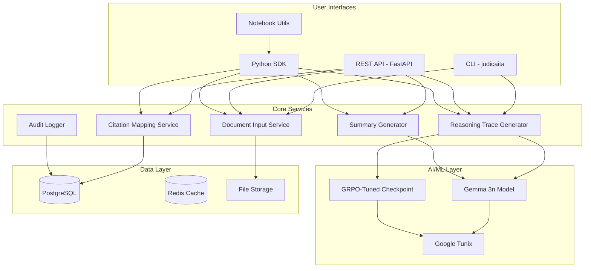

# System Architecture Diagram

## Component Descriptions

| Component | Description |
|-----------|-------------|
| CLI | Command-line interface using Typer |
| REST API | FastAPI server with OpenAPI docs |
| Python SDK | Direct Python API for all services |
| Notebook Utils | Sync wrappers for Jupyter/Kaggle |
| Document Input | PDF/Word processing and extraction |
| Reasoning Trace | Step-by-step legal reasoning |
| Citation Mapping | Legal citation extraction and validation |
| Summary Generator | Plain-English summary creation |
| Audit Logger | Compliance and audit logging |
| Gemma 3n | Base language model |
| GRPO Checkpoint | Fine-tuned reasoning model |
| Google Tunix | Training framework for TPU |
