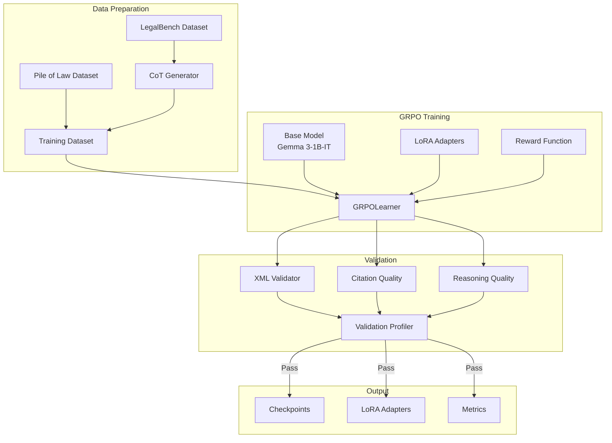
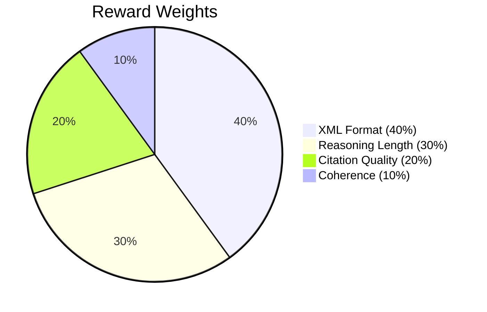
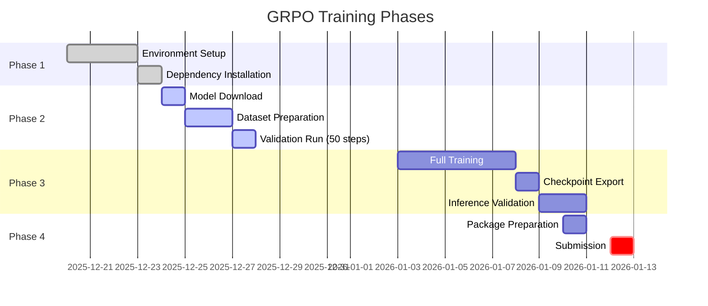

# GRPO Training Pipeline

## Training Architecture

```mermaid
graph TB
    subgraph Data["Data Preparation"]
        LB[LegalBench Dataset]
        POL[Pile of Law Dataset]
        COT[CoT Generator]
        DS[Training Dataset]
    end

    subgraph Training["GRPO Training"]
        BM[Base Model<br/>Gemma 3-1B-IT]
        LORA[LoRA Adapters]
        RF[Reward Function]
        GRPO[GRPOLearner]
    end

    subgraph Validation["Validation"]
        XV[XML Validator]
        CQ[Citation Quality]
        RQ[Reasoning Quality]
        VP[Validation Profiler]
    end

    subgraph Output["Output"]
        CP[Checkpoints]
        AD[LoRA Adapters]
        MET[Metrics]
    end

    LB --> COT
    POL --> DS
    COT --> DS
    
    DS --> GRPO
    BM --> GRPO
    LORA --> GRPO
    RF --> GRPO
    
    GRPO --> XV
    GRPO --> CQ
    GRPO --> RQ
    
    XV --> VP
    CQ --> VP
    RQ --> VP
    
    VP -->|Pass| CP
    VP -->|Pass| AD
    VP -->|Pass| MET
```

## Reward Function Components

```mermaid
pie title Reward Weights
    "XML Format (40%)" : 40
    "Reasoning Length (30%)" : 30
    "Citation Quality (20%)" : 20
    "Coherence (10%)" : 10
```

## Training Timeline

```mermaid
gantt
    title GRPO Training Phases
    dateFormat  YYYY-MM-DD
    section Phase 1
    Environment Setup           :done, p1, 2025-12-20, 3d
    Dependency Installation     :done, p1b, after p1, 1d
    section Phase 2
    Model Download              :active, p2, 2025-12-24, 1d
    Dataset Preparation         :active, p2b, after p2, 2d
    Validation Run (50 steps)   :active, p2c, after p2b, 1d
    section Phase 3
    Full Training               :p3, 2026-01-03, 5d
    Checkpoint Export           :p3b, after p3, 1d
    Inference Validation        :p3c, after p3b, 2d
    section Phase 4
    Package Preparation         :p4, 2026-01-10, 1d
    Submission                  :crit, p4b, 2026-01-12, 1d
```

## Validation Checkpoints

```mermaid
flowchart LR
    subgraph Phase1["Phase 1: Environment"]
        P1A[TPU Detection]
        P1B[Package Versions]
        P1C[Import Validation]
    end

    subgraph Phase2["Phase 2: Training Setup"]
        P2A[Model Load]
        P2B[Dataset Ready]
        P2C[Reward Function]
    end

    subgraph Phase3["Phase 3: Training"]
        P3A[Loss Decreasing]
        P3B[Rewards Varying]
        P3C[Memory OK]
    end

    subgraph Phase4["Phase 4: Output"]
        P4A[XML Format ≥80%]
        P4B[Quality Score ≥0.5]
        P4C[Package Valid]
    end

    Phase1 --> Phase2 --> Phase3 --> Phase4
```
